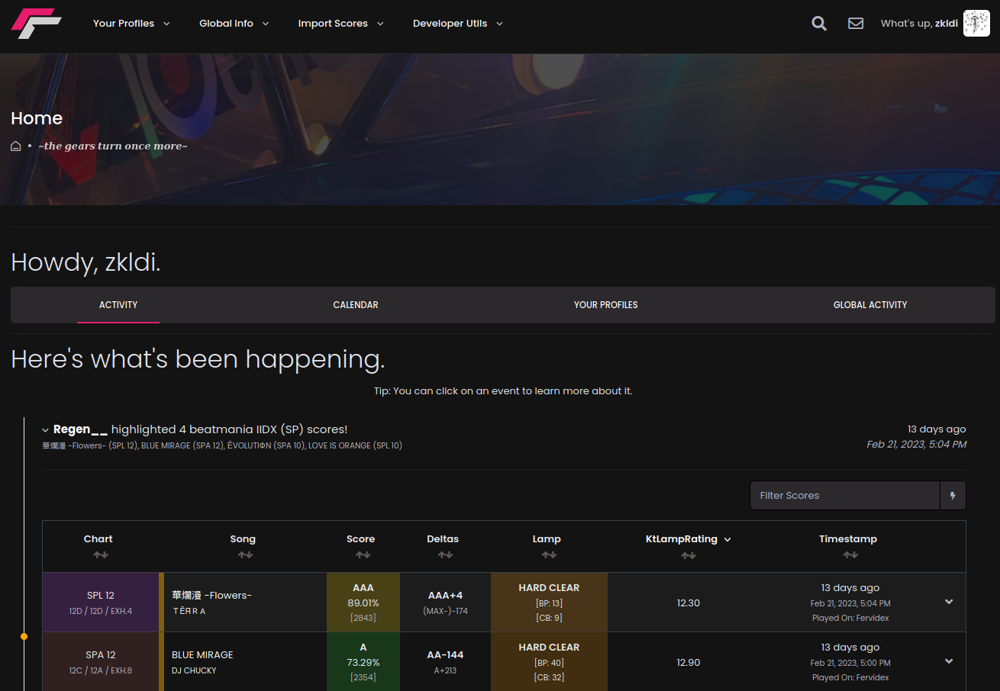
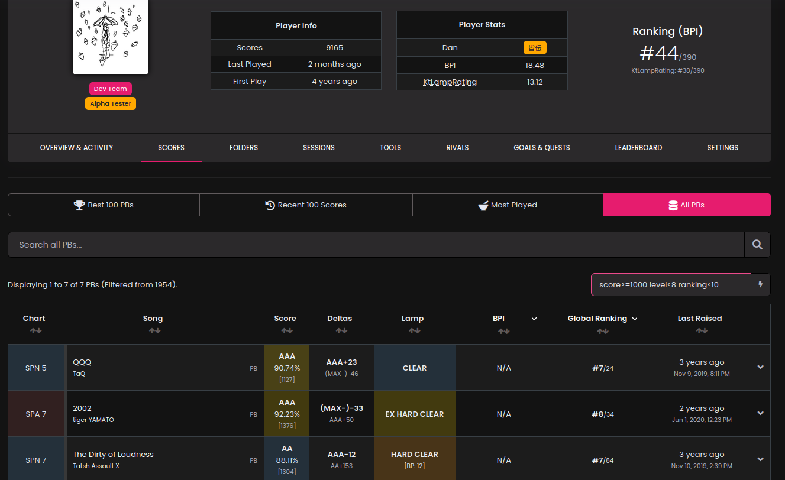

# Tachi

This is the main monorepo for Tachi.

## What is Tachi?

Tachi is a modern, powerful, modular Rhythm Game Score Tracker.

In short, it does the things that people would otherwise make spreadsheets for.

Tachi is a score tracker and analyser for various rhythm games.
It was designed out of a dislike for existing websites that display your scores.
I think that scores are integral to the rhythm game experience, and that displaying them
properly is _just_ as important!

By using Tachi, you get access to powerful, novel rhythm game score-tracking features, like automatically breaking your scores into sessions, setting goals and rivals, and more!

There are way more features that Tachi has, and you can read about all of them [here](https://docs.tachi.ac/wiki/features).

## Setup

Tachi maintains a setup guide that is easy to follow even if you've never programmed before.

Check the [Documentation](https://docs.tachi.ac/contributing/setup) for how to set Tachi up.

You can then check the component-specific guides to see how to run those components and contribute back!

## Quick Setup For Experienced Programmers

Install VSCode and use the dev container extension.
This is my the supported way of working and will ensure you have the correct versions of everything.

### Unsupported stuff

Tachi is intended to be developed inside a container. This ensures that you have the correct version of MongoDB, Redis, Typescript and all that jazz.

VSCode has excellent native support for dev containers, and as such this is the only method of local development we officially support.

Over the years we have had a *lot* of issues with people having subtle variations on their system (or on windows). Given the contributor-centricity of Tachi, it's untenable to expect every contributor to be an expert with local dev setup.

The devcontainer provides us with the most simple, consistent experience, and allows us to put nice-to-haves inside the user's shell.

That said, if you're ardently against using VSCode or Docker...

**DO NOT REPORT ISSUES TO ME IF YOU DO THIS**

You can run the docker-compose file and `dev/boostrap.sh` inside the container yourself. Work inside the container.

Alternatively if you want to work outside of docker you're on your own. Figure out the correct versions for everything (npm, pnpm, mongo, redis, ts-node...) and `dev/bootstrap.sh`.

## Repository Info

This monorepo contains the following codebases:

- `client/`, Which is a React frontend for Tachi. (AGPL3)

The client and the server are fairly decoupled. Someone could trivially create their own frontend client for Tachi.

- `server/`, Which is an Express-Typescript backend for Tachi. (AGPL3)

This contains all of our API calls, and interfaces with our database, and powers the actual score import engine.

- `seeds/`, Which is a git-tracked set of data to be synced with Tachi. (unlicense)

**This is the source of truth for the songs, charts, and more on the site!**
By submitting PRs to this, you can fix bugs on the website, add new charts, and more.

- `bot/`, Which is a discord bot frontend for Tachi. (MIT)

- `common/`, Which contains common types, utils and functions shared between all other packages. (MIT)

This is also published to NPM when it hits production.

- `docs/`, Which contains Tachi documentation. (MIT)

- `sieglinde/`, Which contains our BMS/PMS analysis functions. (MIT)
