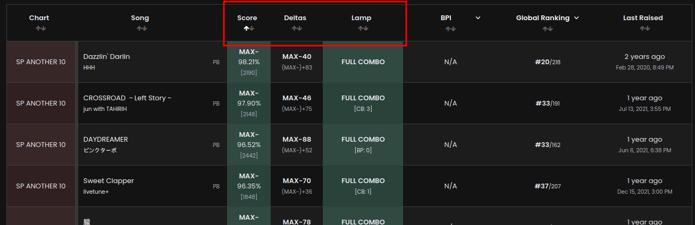
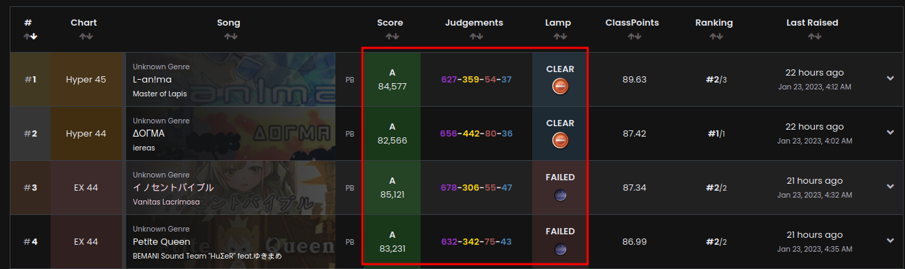
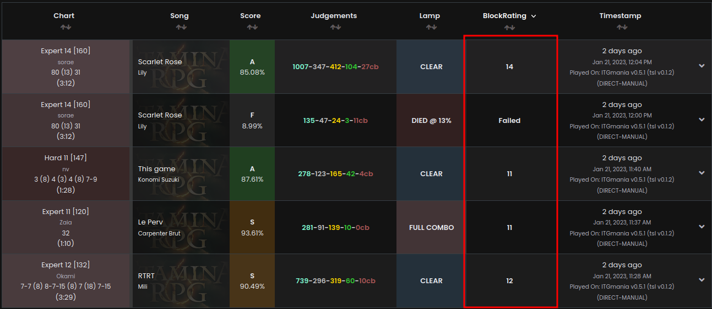

# Client Implementation

As you probably can expect, the client implementation is entirely

## Where do Client Implementations go?

Implementations should be written in `client/src/lib/game-implementations.tsx`.

It's fine to inline implementations here, but feel free to break out into a separate file (See what IIDX does for a reference) if you need to.

## `enumColours`

For all the ENUM metrics in this game, give all of their values colours.

!!! tip
	The `COLOUR_SET` global is useful for this, as it provides consistent identity
	throughout tachi.

## `enumIcons`

What [Font Awesome v5](https://fontawesome.com/v5/search) icon should we use to
represent each enum?

## `difficultyColours`

If this game uses fixed difficulties, give each difficulty name a colour here.

## `classColours`

Give each class value a colour. These are used to render the class badges.

## `ratingSystems`

Although all games have `level` and `levelNum`, some optional properties may be useful here.

This is an array of functions that take a chart and return information about it.

These are used to sort charts in tables when the `difficulty` header is used to sort.

!!! example
	The `CreateRatingSys` util is used for this:

	```ts
	[
		CreateRatingSys(
			"NC Tier",
			"Tierlist Ratings for Normal Clears.",
			(c) => c.data.ncTier?.value,
			(c) => c.data.ncTier?.text,
			(c) => c.data.ncTier?.individualDifference
		),
		CreateRatingSys(
			"HC Tier",
			"Tierlist Ratings for Hard Clears.",
			(c) => c.data.hcTier?.value,
			(c) => c.data.hcTier?.text,
			(c) => c.data.hcTier?.individualDifference
		),
		CreateRatingSys(
			"EXHC Tier",
			"Tierlist Ratings for EX-HARD Clears.",
			(c) => c.data.exhcTier?.value,
			(c) => c.data.exhcTier?.text,
			(c) => c.data.exhcTier?.individualDifference
		),
	]
	```

!!! example
	ITG also uses this to leverage the sorting abilities of this: we want to sort
	things on level, but if the level is the same, we want to break ties on BPM.

	```ts
	[
		CreateRatingSys(
			"BPM",
			"How fast are the streams in this chart?",
			(c) => c.data.streamBPM,
			(c) => c.data.streamBPM?.toString()
		),
	]
	```

## `scoreHeaders`

What should the headers be for the score cells when rendering scores for this GPT?

!!! example
	```ts
	[
		["Score", "Score", NumericSOV((x) => x.scoreData.percent)],
		["Deltas", "Deltas", NumericSOV((x) => x.scoreData.percent)],
		["Lamp", "Lamp", NumericSOV((x) => x.scoreData.enumIndexes.lamp)],
	]
	```

	will correspond to the headers in the red box

	

## `scoreCoreCells`

When rendering a score row, how should we render the actual score information cells?

This function gets `sc`, which is either a score or a PB for this GPT, and `chart`; the chart this score was on.

!!! important
	The amount of cells returned should be **EXACTLY** the same length as the headers.

!!! example
	```ts
	({ sc }) => (
		<>
			<MillionsScoreCell
				score={sc.scoreData.score}
				grade={sc.scoreData.grade}
				colour={GetEnumColour(sc, "grade")}
			/>
			<PopnJudgementCell score={sc} />
			<PopnLampCell score={sc} />
		</>
	),
	```

	will correspond to the cells in these columns.

	

## `ratingCell`

How should we render the rating cell for this GPT?

This is a function that takes in the aforementioned `sc` and `chart`, alongside `rating`, which is the currently selected score rating algorithm.

!!! example
	```ts
	({ sc, chart, rating }) => (
		<>
			{rating === "blockRating" ? (
				<td>
					<strong>
						{chart.data.rankedLevel === null
							? "Unranked Chart."
							: sc.calculatedData.blockRating === null
							? "Failed"
							: sc.calculatedData.blockRating}
					</strong>
				</td>
			) : (
				<RatingCell score={sc} rating={rating} />
			)}
		</>
	),
	```

	will correspond to the cells in this column.

	

## That's it!

Congrats! If you've done this, the [Server Implementation](./server-impl.md) and the [Common Configuration](./common-config/index.md), you've just added full support for a game to Tachi! Nice job!