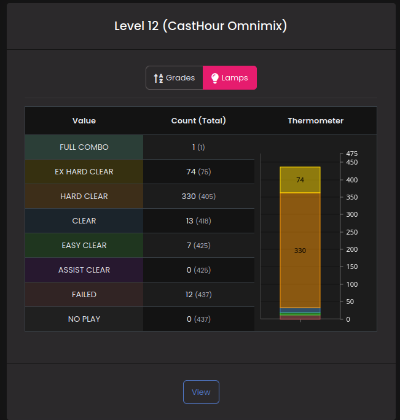

# Common Configuration

This page documents how support for a game is written in `common/`.

There are two kinds of configs here.

## Where do configurations go?

Configurations should be written in `common/src/config/game-support/GAMENAME.ts`.

Once you have written a config, go to `common/src/config/config.ts` and import it. Mount the game configuration on `GAME_CONFIGS`, and the GPT configuration on `GAME_PT_CONFIGS`.

## A quick note on Games vs GPTs.

A game config is configuration for a game. Games in Tachi aren't actually the meaty part of support, instead, games form a kind of "group" for their playtypes.

For example, in IIDX there are two kinds of playtypes - Single Play and Double Play. Although these are completely separate kinds of games (it wouldn't make sense to share scores between them), they do share songs.

The game part - in this case `iidx` - defines things that are shared between all of its playtypes - things like what to call the game and what the song documents look like.

Whereas the game + playtype (typically shortened to GPT) is the part that contains almost all of the actual configuration. This distinction will become more obvious when you see the difference in size between the two configs.

!!! note
	I picked the shorthand `GPT` before ChatGPT et. al. blew up. Ah well.

## Game Configurations

Here is an example configuration - taken from our actual implementation of IIDX.

```ts
export const IIDX_CONF = {
	name: "beatmania IIDX",
	playtypes: ["SP", "DP"],
	songData: z.strictObject({
		genre: z.string(),
		displayVersion: z.nullable(z.string()),
	}),
} as const satisfies INTERNAL_GAME_CONFIG;
```

!!! note
	`game` in Tachi is a bit of an unfortunate name. While - intuitively - most people
	will think of the game as the important part, `game` in Tachi functions more like
	a "grouping" of playtypes.

	Our IIDX game contains two playtypes - SP and DP, these are implemented almost
	entirely separately -- SP and DP could have entirely different calculations if they
	wanted!

	Things should be grouped together if the songs involved in the game can have
	multiple charts across-playtypes. Since songs in IIDX can have SP and DP difficulties,
	they share a `game`!

### `name`

This is the name for the game that will be displayed to end users. This should be formatted generally how the game formats things.

### `playtypes`

The list of playtypes this game supports. For games that only have one playtype (and likely will never have another), "Single" is typically used.

!!! example
	For SDVX, we use `playtypes: ["Single"]`. Since SDVX doesn't normally have any sort of separate playtypes.

### `songData`

What game-specific properties should exist on a song?

This is written as a [Zod](https://github.com/colinhacks/zod) schema, which allows us to simultaneously declare the type of additional data, and how to validate it.

This game-specific information is stored on the `data` field of a song.

!!! example
	Here's an example IIDX song:

	```json
	{
		"altTitles": [],
		"artist": "dj nagureo",
		"data": {
			"displayVersion": "1",
			"genre": "PIANO AMBIENT"
		},
		"id": 1,
		"searchTerms": [],
		"title": "5.1.1."
	},
	```

	Note the `data` field, which allows for game-specific metadata.

## GPT Configurations

This is the *real* meat-and-potatoes for implementing something for Tachi.

Here is our actual implementation for WACCA's Single playtype.

!!! note
	WACCA only has one playtype - "Single".

```ts
export const WACCA_SINGLE_CONF = {
	providedMetrics: {
		score: {
			type: "INTEGER",
			validate: p.isBetween(0, 1_000_000),
			formatter: FmtNum,
			description: "The score value. This is between 0 and 1 million.",
		},
		lamp: {
			type: "ENUM",
			values: ["FAILED", "CLEAR", "MISSLESS", "FULL COMBO", "ALL MARVELOUS"],
			minimumRelevantValue: "CLEAR",
			description: "The type of clear this score was.",
		},
	},

	derivedMetrics: {
		grade: {
			type: "ENUM",
			values: [
				"D",
				"C",
				"B",
				"A",
				"AA",
				"AAA",
				"S",
				"S+",
				"SS",
				"SS+",
				"SSS",
				"SSS+",
				"MASTER",
			],
			minimumRelevantValue: "S",
			description: "The grade this score was.",
		},
	},

	optionalMetrics: {
		...FAST_SLOW_MAXCOMBO,
	},

	defaultMetric: "score",
	preferredDefaultEnum: "grade",

	scoreRatingAlgs: {
		rate: {
			description: "Rating as it's implemented in game.",
		},
	},
	profileRatingAlgs: {
		naiveRate: {
			description: "A naive rating algorithm that just sums your 50 best scores.",
		},
		rate: {
			description:
				"Rating as it's implemented in game, taking 15 scores from the latest version and 35 from all old versions.",
		},
	},
	sessionRatingAlgs: {
		rate: { description: "The average of your best 10 ratings this session." },
	},

	defaultScoreRatingAlg: "rate",
	defaultProfileRatingAlg: "naiveRate",
	defaultSessionRatingAlg: "rate",

	difficulties: {
		type: "FIXED",
		order: ["NORMAL", "HARD", "EXPERT", "INFERNO"],
		shorthand: {
			NORMAL: "NRM",
			HARD: "HRD",
			EXPERT: "EXP",
			INFERNO: "INF",
		},
		default: "EXPERT",
	},

	classes: {
		stageUp: {
			type: "PROVIDED",
			values: WaccaStageUps,
		},
		colour: {
			type: "DERIVED",
			values: WaccaColours,
		},
	},

	orderedJudgements: ["marvelous", "great", "good", "miss"],

	versions: {
		reverse: "REVERSE",
	},

	chartData: z.strictObject({}),

	preferences: z.strictObject({}),
	scoreMeta: z.strictObject({ mirror: z.boolean().optional() }),

	supportedMatchTypes: ["songTitle", "tachiSongID"],
} as const satisfies INTERNAL_GAME_PT_CONFIG;
```

We'll go over each bit of this.

## Metrics

See [Metrics](./metrics.md) and [Metric Groups](./metric-groups.md).

## `defaultMetric`

What should the default metric for this GPT be? This is used for chart leaderboards,
and should *ideally* be an `INTEGER` or `DECIMAL` metric. It is not legal for this
to be a `GRAPH` or `NULLABLE_GRAPH` metric, as those are not sanely comparable.

## `preferredDefaultEnum`

If the user has no preferences overriding this, what should this GPT default to showing
when showing enum graphs?

!!! example
	

	Here, we see that the site has picked lamps by default to show. This is because
	the default enum for IIDX is `lamp`.

!!! note
	Users may override this preference in their settings for this GPT.

## Score, Session, Profile Rating Algorithms

These are all the exact same idea, but appear in different parts of Tachi.

All of these define the names of rating algorithms and a description.

Rating algorithms are functions that return a number or null. This can be used
to implement things like VOLFORCE (SDVX, USC) or tierlist ratings.

Optionally, a rating algorithm's config may specify a `formatter:` field, which is
a function that transforms the number into a string somehow. If this is not specified,
this will default to a function that rounds the number to two decimal places.

## Difficulties

There are two kinds of difficulties available in Tachi. `"FIXED"`, which is a more traditional approach defining a fixed set of possible difficulties for your song (NORMAL, HYPER, ANOTHER, etc.), and `"DYNAMIC"`, which allows any arbitrary string as a difficulty name.

### Dynamic Difficulties

Dynamic difficulties are intended for use in games where a song may have any number of possible charts.

An example of this would be something like `osu!`, where a song may have as many difficulties as it wants, with *any* string as their name.

### Fixed Difficulties

For games where songs can only have a certain amount of difficulties (most arcade games)
a fixed config likely makes more sense.

With a fixed config, you define the `order:` in which these difficulties appear in,a default difficulty to redirect to if the song is selected in the search bar and
optionally, some shorthand (generally for mobile view).

!!! example
	```ts
	difficulties: {
		type: "FIXED",
		order: ["NORMAL", "HARD", "EXPERT", "INFERNO"],
		shorthand: {
			NORMAL: "NRM",
			HARD: "HRD",
			EXPERT: "EXP",
			INFERNO: "INF",
		},
		default: "EXPERT",
	}
	```

## Classes

Classes are enums for profiles. These allow you to store discrete values on a user's
profile. What values are supported are controlled by the `values:` field.
You can use the `ClassValue` helper function to help define values.

There are two types of classes:

### "DERIVED"

In which the value of the class is derived from the user's profile metrics.

!!! example
	A common example of this would be things like `colour` rankings in konami arcade
	games. These are cutoffs like `>1500 jubility = ORANGE, >2000 jubility = GREEN`.

### "PROVIDED"

In which the value of the class is provided by a score import somehow.

!!! example
	A common example of this would be things like dans. These are not functions
	of existing state, and must be stated in an import method.

!!! note
	"DERIVED" classes are allowed to go back down - if the deriving implementation
	says the class is now worse, the class the user has will decrease.

	However, "PROVIDED" classes cannot be superceded by worse ones - if the user was
	10th dan and then cleared 3rd dan, their dan will *not* be overwritten. The only
	way for a "PROVIDED" class to go down is to contact an admin at the moment.

	Maybe the in the future, users could have the ability to manually wipe their own
	classes, in-case they corrupt their profile.

## `orderedJudgements`

An ordered list (best to worst) of strings, representing the name of judgements (hit windows) for this GPT.

## Versions

See [Versions](./versions.md), as whether your GPT needs this or not requires some assessment.

## Chart Data

The `chartData` field allows you to define GPT-specific fields on chart documents.

For example, in IIDX we *need* to store the `notecount` of a chart somewhere (it's used to calculate `percent` and `grade`).

The `chartData` field is a [Zod](https://github.com/colinhacks/zod) schema indicating the structure of this additional information.

!!! example
	```ts
	chartData: z.strictObject({
		inGameID: z.number().int().nonnegative(),
		clearTier: z.strictObject({
			value: z.number(),
			text: z.string(),
			individualDifference: z.boolean(),
		}).nullable(),
	}),
	```

	declares that a chart for this GPT should look like:

	```ts
	{
		"chartID": "5088a4d0e1ee9d0cc2f625934306e45b1a60699b",
		"data": {
			"inGameID": 1,
			"clearTier": { value: 12.5, text: "12C", individualDifference: false }
		},
		"difficulty": "ADV",
		"isPrimary": true,
		"level": "10",
		"levelNum": 10,
		"playtype": "Single",
		"songID": 1,
		"versions": ["exceed", "konaste"]
	},
	```

	Note the GPT-specific properties in the `data` field now.

## Preferences

If this GPT should have specific preferences (for BMS, you can set a list of tables you don't want to see, for example), list them here as a Zod schema.

!!! example
	A `preferences` of 

	```ts
	preferences: z.strictObject({ showCustomCharts: z.boolean() })
	```

	corresponds to a settings document of:
	```ts
	[
		{
			"userID": 1,
			"game": "iidx",
			"playtype": "SP",
			"preferences": {
				"preferredScoreAlg": null,
				"preferredSessionAlg": null,
				"preferredProfileAlg": null,
				"preferredDefaultEnum": null,
				"defaultTable": null,
				"preferredRanking": null,
				"stats": [],
				"gameSpecific": {
					"showCustomCharts": false
				}
			},
			"rivals": []
		}
	]
	```

	Note the `preferences.gameSpecific` part, which holds these game-specific
	preferences.

## Score Metadata

Sometimes, we want to store stuff about a score that isn't really related to a metric.

A common example of this would be something like the mods the player was using - were
they using RANDOM, MIRROR, etc?

!!! note
	Score Metadata **DOES NOT** appear on PBs. This metadata is *specific* to the score
	itself, and would never make sense to merge.

	If a PB is comprised of a best score using RANDOM, and a best lamp using MIRROR,
	what should the PB merge to? It doesn't make any sense as an operation.

This, similarly, is a Zod schema, and appears on a score documents `scoreMeta` field.

## Supported Match Types

This is for [BATCH MANUAL](todo) usage. BATCH MANUAL has to specify a `matchType` - how should it resolve a given identifier?

Some import methods might want to use in game IDs, hashes of a certain kind, etc.

For a list of all possible match types, see [Match Types](./match-types.md).

You should list the available `matchTypes` in this field of the config.
